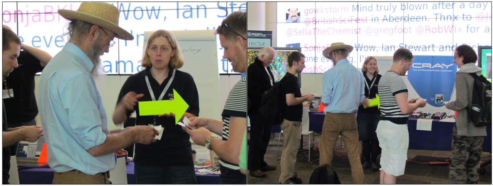
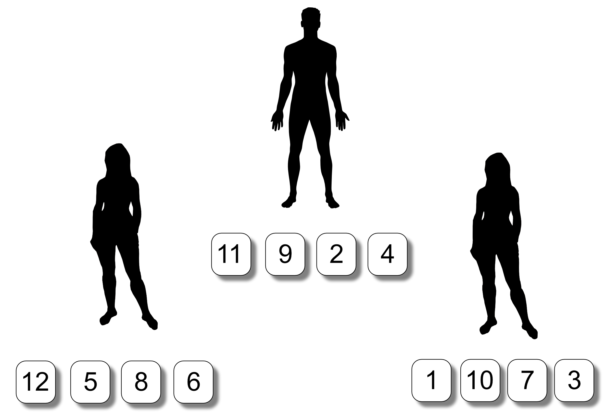
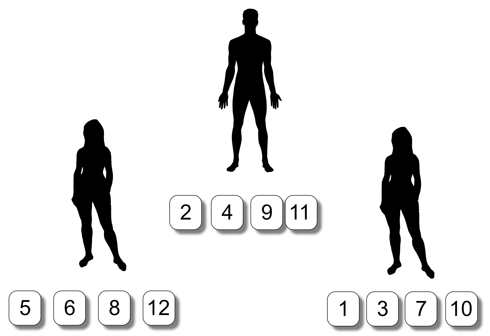
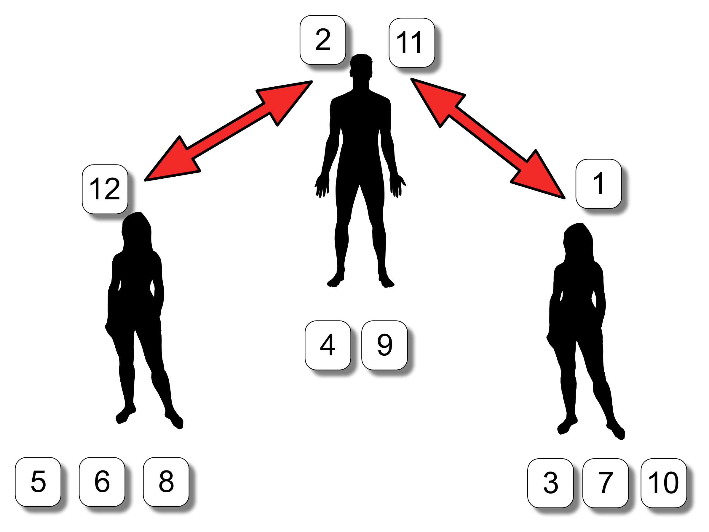
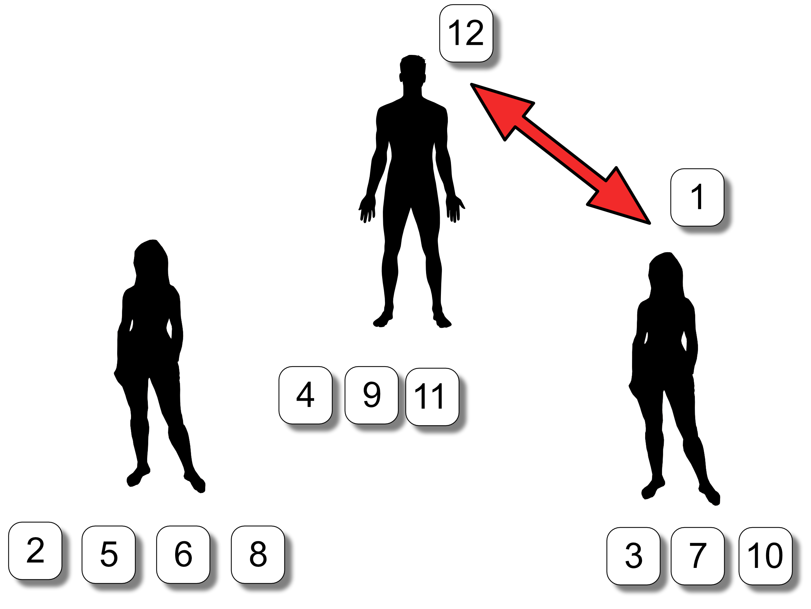
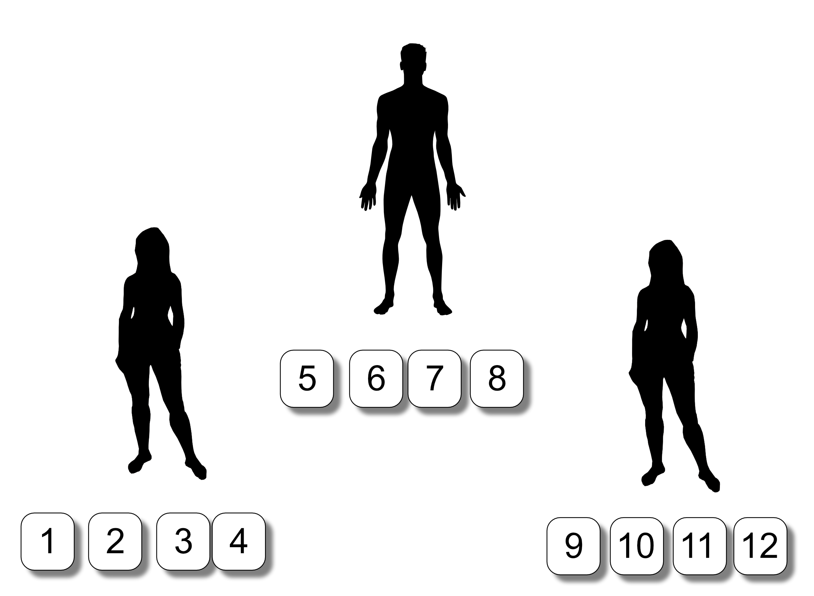

<!-- Begin Header -->
<table width="100%" border="0" cellpadding="0" cellspacing="0">
<tr>
<td markdown="span">

</td>
<td markdown="span">

</td>
<td markdown="span">

</td>
</tr>
</table>
<!-- End Header -->

# Message passage sorting

**Version: 1.1**

For the latest version of this document please see:

* https://github.com/EPCCed/Activities/tree/master/Activities/MessagePassingSort

## Aim

The aim of this activity is to demonstrate in a simple and effective
manner:

* A parallel sorting algorithm for a list of numbers using message
  passing techniques.

This activity is best suited for a classroom or workshop environment. It
will require a level of coordination by the facilitator leading the
activity and is thus not suitable for a high throughput environment
like a science festival.

## Learning objectives

* Demonstrate how message passing helps resolve inter-process
  dependencies.
* Highlight process task concepts in parallel computing.

## Equipment

* Set of cards with Integers clearly printed on them.

An early version of the Message Passing Sort being tried out at the
British Science Festival held in Aberdeen in 2012. The arrow is being
used to indicate in which direction the sorts should be taking place
in.

### Note

Using positive integers will allow a wider audience to participate in
this activity.

The numbers do not need to form a continuous sequence although they 
are in this example.

Ensure that there is a larger supply of cards that you anticipate
using in each activity run.  This will allow you to work with large
participant numbers and replace any damaged or lost cards.

## Overview

The participant numbers for this activity are restricted by space,
equipment and the activity organiser.

Remember the more cards or participants you have the longer it will
take to complete this activity.

### Suitability

Venue: Classroom, Community Group, Workshop
Age: 7+

### Note

This activity can be a little confusing - it requires the organiser to keep
track and help out where things go awry. The important thing is not to
panic - this is normal.

## Procedure

The activity will be illustrated using three participants and cards
numbered 1 to 12.  The activity can be extended to larger numbers of
people and cards.

### Set-Up

Number the participants starting from 0 to P-1, where P is the total
number of participants.

Ensure each participant knows their number and whether it is an even or
odd number (if you think that they will require some assistance to
determine this you could provide some stickers indicating whether even
or odd).

For this example we assume that we have three participants, they will thus be numbered 0,1,2.Include the number zero in the even group to make this activity easier to explain. You could use 1 to P to number the participants but this activity starts at 0 which aligns with a lot of
programming languages and the [Message Passing Interface](http://mpi-forum.org/) (MPI) library
commonly used to implement this algorithm type.  If you are familiar with MPI we are assiging the participants ranks. This is a judgement
call depending on your confidence and your audience.

### Process

<!-- Do not put a new line when going to a new 
     numbered item otherwise markdown will start
     renumbering from 1! -->
     
1. Get the participants to stand in a line, shuffle the numbered cards and give
   each participant 4 cards:

2. Each participant should do a local sort their assigned cards, lowest to highest:

3. Even numbered participants compare their highest valued card number with
the lowest card number of their highest odd numbered neighbour.  In this
example, participant 0 will compare with participant 1 while participant 2 will be idle.  If the odd
numbered participant has the lower number then swap numbers.
	     

4. Participants who received a new number should resort their cards.
   

5. Even numbered participants compare their lowest card number with
the highest card number from their lowest odd numbered neighbour.  In this
example 2 will compare with 1 and 0 will be idle.  If the even
numbered participant has the lower number then swap numbers.

6. Participants who received a new number should resort their cards.

7. Repeat steps 3,4,5,6 Go until the cards are sorted:

### What is the terminating condition? 

As the organiser has a global view, they can see when the list is
completely sorted.

How do the participants to recognise the entire list has been sorted
when they are only know about their own numbers?

## Discussion

**Question**: How does the number of people affect the sort?

**Question**: How does the number of cards affect the sort?

**Question**: What changes could be made to improve performance?

**Question**: Can the participants develop a different approach?

## Want to know more?

If you want to know more about EPCC Outreach activities visit:

* https://www.epcc.ed.ac.uk/discover-and-learn

## Acknowledgements

* Male silhouette came from the [man shape](https://openclipart.org/detail/182185/man-shape) at openclipart.
* Female silhouette came from the female from the [Man/woman shape Carl Sagan plate](https://openclipart.org/detail/269831/manwoman-shape-carl-sagan-plate) at openclipart.

<!-- Licensing and copyright stuff below -->
 

 
This work is licensed under a <a rel="license" href="http://creativecommons.org/licenses/by-nc-sa/4.0/">
Creative Commons Attribution-NonCommercial-ShareAlike 4.0 International License</a>. 
&copy; Copyright EPCC, The University of Edinburgh 2017.
