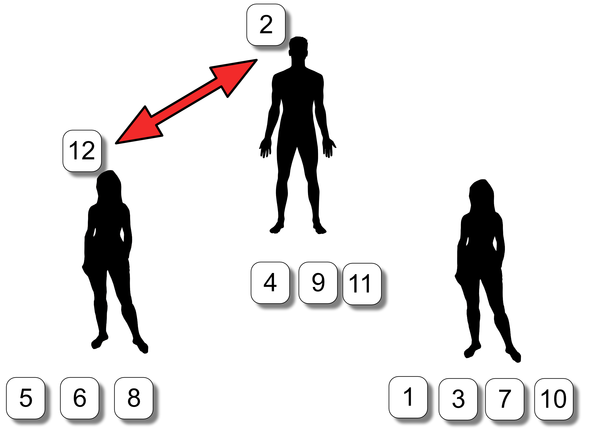
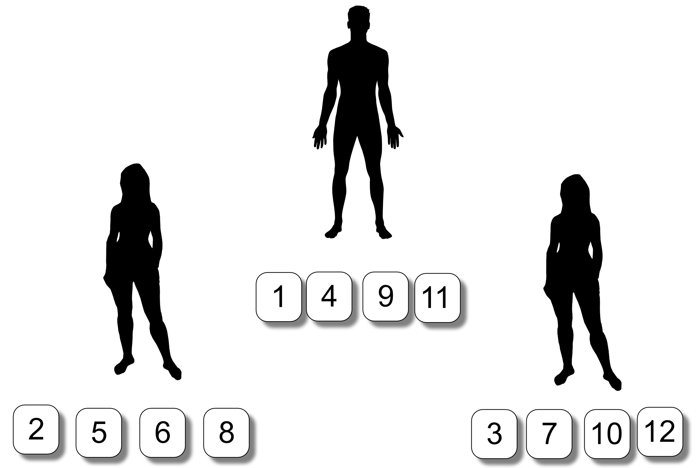

# Message passage sorting

Demonstrate how a list of numbers can be sorted in parallel.

## Learning objectives

* Demonstrate how message passing can help to resolve inter-process dependencies.
* Highlight the concept of a process task in parallel computing.

## Equipment

* Set of Cards with Integers clearly printed on them.

Using positive integers on the cards will make this activity to a wider audience.

It is not required that the numbers form a continuous sequence, it can skip numbers, so a small set could be:

1,4,6,10,14,17,18,20,43,47,65,99,102,143,201,546

The number of cards is determined by the number of participants. It would be adventageous to have a larger number of cards that you anticipate using. 
This will help with unexpected numbers of participants and if any cards are lost or damaged.

## Overview

This activity can have as many people as you are comfortable with handling.

Remember the more numbered cards or people you have participating the longer it will take.

### Suitability

Due to the time required for setup, instructions, doing it and questions, this 
activity is more suitable for a school classroom, community group or workshop 
instead of a drop-in activity at a science festival. 

### Note

This activity can be confusing - it requires that you keep track of what is going on and
helping out where things go awry. The important thing is do not panic - this is normal.

## Procedure

This procedure example will assume 3 people are participating using a set of cards numbered from 1 to 12.
This example can be extended beyond this to a larger number of people and cards.
Number the participants starting from 0 to P-1, where P is the total number
of participants. Ensure each participant know their number and whether it is an even or odd number.

### Note

Include Zero (0) in the even group to make this easier to deal with.

### Note
You can use 1 to P but a lot of programming languages and the Message Passing Interface
(MPI) library commonly used to implement this type of algorithm start counting from zero.
This can be a judgement call depending on your confidence and your audience.

<!-- Do not put a new line when going to a new 
     numbered item otherwise markdown will start
     renumbering from 1! -->
     
1. Get the participants to stand in a line, shuffle the cards and give each of them 4 cards:

2. Get each participant to sort the cards they have been assigned, lowest to highest:

3. Now get even numbered participants to compare the highest number they have
with the lowest number the next highest odd numbered person has. For example 0 will turn to 1, 2 will turn to 3, and so on.
This means odd numbered participants turn to the even numbered participants with the number before them and
compare their lowest number with the other participants highest number. If the lower number is higher than the high number then
swap otherwise do nothing. 
	     

4. If a participant received a new number, that participant should do a sort of their numbers.
   

5. Now even numbered participants must turn to the lower odd numbered participant next to them and
compare their lowest number with the highest number of that participant. This means odd numbered people turn to
the next highest even number participant. If the even participant has a lower number then swap otherwise do nothing. 

6. If a participant received a new number, that participant should do a sort of their numbers.

7. Go back to the first message passing routine (step 3) until all the cards are sorted:

### What is the terminating condition? 

As you (the person running it) have a global viewpoint, it's easy to see when the list will be completely sorted. 

How do you get all the processes (participants) to recognise that the entire list has been sorted if they are only privvy to their own local data?

## Discussion

**Question**: Could this have been done differently?

**Question**: What effect do you think the number of people has on the sort?

**Question**: Does the input data size have any effect?

**Question**: What changes could be made to improve performance?

## Acknowledgements

* Male silhouette came from the [man shape](https://openclipart.org/detail/182185/man-shape) at openclipart.
* Female silhouette came from the female from the [Man/woman shape Carl Sagan plate](https://openclipart.org/detail/269831/manwoman-shape-carl-sagan-plate) at openclipart.

<!-- Licensing and copyright stuff below -->
 

 
This work is licensed under a <a rel="license" href="http://creativecommons.org/licenses/by-nc-sa/4.0/">
Creative Commons Attribution-NonCommercial-ShareAlike 4.0 International License</a>. 
&copy; Copyright EPCC, The University of Edinburgh 2017.
