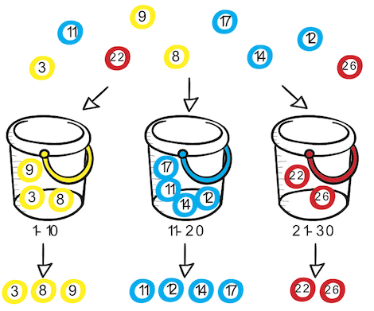
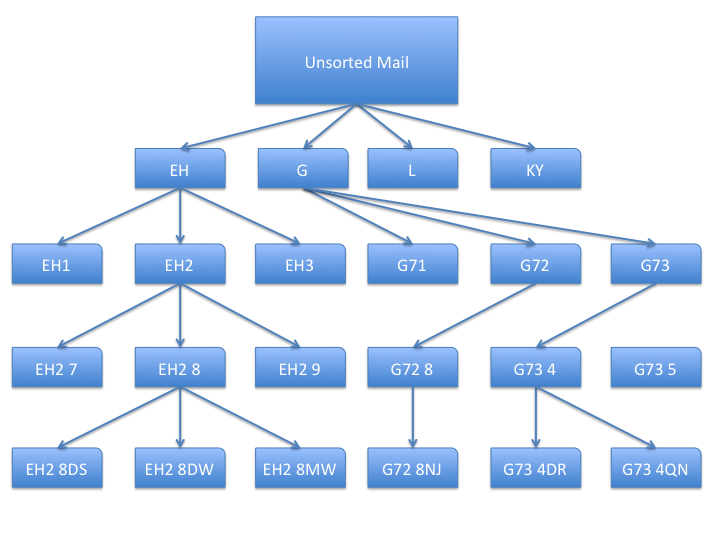
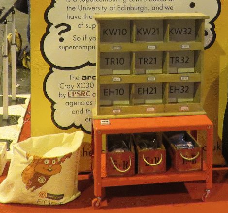
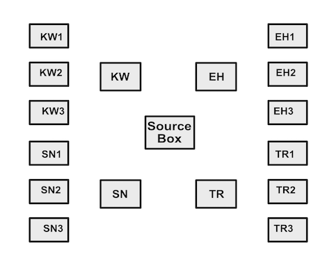
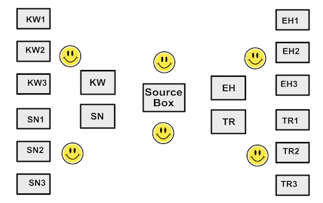

# Postal sort

## Background

Data often has to be sorted. This may be done to facilitate access or to make access to the data more efficient. However, if the amount of data that has to be sorted, or how it has to be sorted, is very large then this process may end up being very time-consuming and thus expensive.  For example, sorting stock using a serial number could involve a large number of time-consuming comparison of the serial number for each item of stock and to do this for the whole volume of stock can be inefficient. If the amount of data is 
very large, then perhaps a machine or single person could not do it alone in an acceptable amount of time, so we would have mutliple sorters working together. 

To make large volumes of data in more easily handled volumes of data, we can split it up into chunks and then each sorter can 
work on a chunk of data, but then we need to have some way to merge them or do lots of communications and swap data between sorters.

To try and make this a little easier, we can use a sorting algorithm called a [bucket
sort](https://en.wikipedia.org/wiki/Bucket_sort), it is distribution sort related to radix sort but more generalised.
In this algorithm, we group the data into 'buckets' which have a common identification or grouping (like the numbers 0-9, 10-19, 20-29,...), 
then these buckets can be sorted individually and do not need to communicate with each other. Inside the buckets can be another bucket sort, a quick sort or it maybe that just getting into that bucket is enough to work with.

If we use a list of numbers as our example, the bucket sort starts by separating the numbers into groups known as buckets. 
In the example below the numbers are first separated into three buckets: numbers below or equal to 10, numbers between
11 and up to and including 20 and over 20.

The numbers inside each bucket are then sorted. There are two
different stages that can thus be parallelised and different strategies
can be explored to obtain the optimal throughput.

## Learning objectives

* Multiple workers sorting can do more than one worker in the same
 amount of time or the same goal can be achieved in less time.
    * Recognise parallelism in everyday life.
* Reasoning behind modern computers employing parallelism.
    * Generate examples of parallelism in computers.
* Concepts of hierarchy in data and processing.
    * Multiple algorithms in the same overall process.
    * Recognising exploitable data structures and hierarchy.

## Scenario

How letters are sorted by a post office is an example of a bucket sort.
This is a variant of a classic bucket sort which makes use of the structured nature of the postcode and address.

When letters are gathered for delivery across a country by the post office, they have to be sorted into different postal areas.
In the UK, this is determined by the post code. A postcode can represent a street (or part of one), a group of buildings, a single address or an organisation.
For example a street may share the same postcode with the distriminating information ending in the address house number. Further information on UK postcodes can 
be found at [UK Post Codes on Wikipedia](https://en.wikipedia.org/wiki/Postcodes_in_the_United_Kingdom).

By using this structured information, we will be able to carry out a bucket sort on a set of letters with post codes and addresses. 

We can use the structure of the post code to create our buckets for sorting into. As there are multiple levels of information in the post code we can do a 
multi-level sort - how the letters are filtered from single mass to be delivered to achievable individual postal routes.

In the post code, there are four main elements - the postcode area, district, sector and unit, as shown below. Each builds upon the previous one, 
so once the letters are sorted into area that can then be sorted seperate from all the other areas.

| Level | Value |
|-------|-------|
| Area  | EH    |
| District | EH9 |
| Sector | EH9 3 |
| Unit  | EH9 3FD |	 

The sort will start by splitting up the letters into area, then district, sector and unit. Once in the unit boxes, a postman would need to use the other lines
of the address to determine the final destination (house number 39 not 37 on a street for example).

These post codes can be sorted in a hierarchy based on this information. This diagram shows how letters for post codes EH2 8DS, EH2 8DW, EH2 8MW, G72 8NJ, G73 4DR and G73 4QN would be sorted through the different levels
of area, district, sector and unit.

This activity has a number of letters that need to be sorted for
delivery. We first separate the postcodes into areas (the first letters in the post code):
so for the example post codes EH10, EH21 and EH32 need to be put into an EH bucket,
while TR10, TR21 and TR32 head for a TR bucket.

These buckets can then be sorted into districts, so in the EH bucket, letters for EH10 would be put into one bucket, EH11 another and so on.

This can be repeated down the information in the postcode until the letters are sorted into the individual units ready for the postman to deliver them.

At this stage the postman would be responsible for ordering the letters for delivery.

This is an example of a multiple level sort which can benefit for parallelism. It does not have to be the same worker at each level, so each level of the sort can be 
carried out as it gets new letters. Workers could be reassigned if their level has finished, moving down the sort levels.

This can be carried out at various levels - maybe you only need to show two levels in operation, for larger groups to get more people involved it may be benefical to have more levels (depending on equipment and space).

## Equipment

To perform this activity you will need:

  * Containers to sort envelopes into. These can printer paper box, stackable letter trays or buckets. You need containers for each final postcode plus any 
    intermediate steps. Our example has twelves boxes for the postcode districts and three boxes for the postcode areas making fifteen boxes total.
  * Container Labels - each container to be sorted into need a label with area, district, sector or unit - what is used is determined by your situation.
  * A container to hold the unsorted envelopes.
  * Envelopes for your participants to sort. These should have post codes on them which can be used as the basis for the sort.
  * Timer

### Envelopes

You can make your own envelopes with postcodes from your surrounding area or print the following example 36
    [address&nbsp;labels](pdf/Post_sorting_address_labels_AveryL7163.pdf)
    on Avery No. L7163 post label pages (or equivalent).  

You will want to have a large number of envelopes and print three to five copies of these will result in a reasonable size set. 

As an additional cosmetic detail you can print a set of [stamps](pdf/Post_sorting_stamps_AveryL4736REV-25.pdf)
for your envelopes. You can print these ARCHER stamps to complete your envelopes on Avery No. L4736REV-25 labels (or equivalent). There are 48 stamps per page. 
     
As the envelopes are likely to get a lot of handling laminating them will increase their durability.

### Example Kit

 
Example kit with the bag containing the envelopes on the left, the
pre-sorting trays in the trolley (we were unable to use these because
of space constraints) and the labelled final pigeon holes the letters
go into.

 

## The Activity

### Setting up the demo

* **Setup up the envelopes**. Stick an address label and stamp on each envelope. 
* **Label your boxes**. Label each box with the postcode parts that you will use. You will need one for each bucket in each stage of your sort:
  For example, a two level sort on area and district using postcodes in KW, EH, SN and TR (this is a subset of available districts) would need the following labels:
   * KW
      * KW1 (for KW10, KW14 and KW18)
      * KW2 (for KW21, KW23, KW24 and KW29)
      * KW3 (for KW30 and KW32)
  * EH
      * EH1 (for EH10, EH14 and EH18)
      * EH2 (for EH21, EH23, EH24 and EH29)
      * EH3 (for EH30 and EH32)
   * SN
      * SN1 (for SN10, SN14 and SN18)
      * SN2 (for SN21, SN23, SN24 and SN25)
      * SN3 (for SN30 and SN32)
   * TR
      * TR1 (for TR10, TR14 and TR18)
      * TR2 (for TR21, TR23, TR24 and TR29)
      * TR3 (for TR30 and TR32)

## Running the activity 

* Shuffle the envelopes in the unsorted container.

* Arrange your EH, KW, SN and TR boxes around the unsorted container.

* Arrange your EH1, EH2 and EH3 boxes around the EH box; your KW1, KW2 and KW3 boxes around the KW and so on...

 
Possible arrangement of the boxes.

Now get the participants to organise themselves to different jobs: 
you need people to sort from the unsorted container into the area buckets and people
to sort from the area buckets into the district buckets.

If you don't have enough people sorting into the buckets then the secondary sorters will have to wait
until they have letters to sort. 

A possible allocation is in the diagram below.

 

In this instance 2 people have been allocated to
put letters into the buckets and 4 into the district buckets. 

Now get the participants to sort the letters from the unsorted container to the area buckets. You should give them a time in which to sort as many as they can.

After the time is finished, you can discuss with them what went well/poorly, what could change, what problems there were? They can try it again, changing things around.

Let the participants drive the activity to experiment with the ideas contained in it.

## Discussion points

**Question**: Is this too few/many? 

**Question**: What is the best configuration to maximise the number of letters sorted in a minute?

**Question**: Would it be better to put everyone on doing the bucket sort and then moving on to the bins or would you be
better to dynamically move your sorters from the bucket sort to the final bit sort withing the minute
allocated to do the sorting?

**Question**: How could you sort more envelopes in the same amount of time? 

**Question**: How could you use multiple people to do this sort?

**Question**: How does the number of envelopes sorted in 30 seconds change with number of people? 

**Question**: How does this compare to a single person sort?

**Question**: How could you make this more efficient? (consider placement
of boxes, overlapping steps etc.)

<!-- Licensing and copyright stuff below -->

 
This work is licensed under a <a rel="license" href="http://creativecommons.org/licenses/by-nc-sa/4.0/">
Creative Commons Attribution-NonCommercial-ShareAlike 4.0 International License</a>. 
&copy; Copyright EPCC, The University of Edinburgh 2017.
