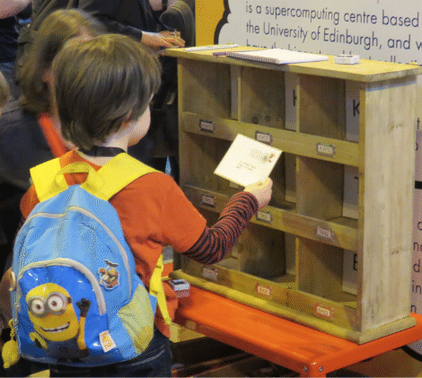

# Postal sort

## Learning objectives

* Multiple people sorting can do more than one person in the same
 amount of time or the same end can be achieved in less time.
   * Reasoning behind modern computers employing parallelism.
* Concepts of hierarchy in data and processing.
   * Multiple algorithms in the same overall process.
   * Recognising exploitable data structures and hierarchy.

## Motivation
This is an example of a [bucket
sort](https://en.wikipedia.org/wiki/Bucket_sort). For this activity we have a number
of letters with specific postcodes that need to be sorted for
delivery. We first separate the postcodes into the major components:
so for the example provided all of the EH10, EH21 and EH32 need to be aggregated into an EH box,
the TR10, TR21 and TR32 get aggregated into a TR box and so on.
The letters are later separated into the individual postcodes ready for
the postman to deliver them.

In general, bucket sorts start by separating the numbers into groups
– called buckets. In the example below the numbers are first separated
into three buckets: numbers below or equal to 10, numbers between
11 and up to and including 20 and over 20.

The numbers inside each bucket are then sorted. There are two
different stages that can thus be parallelised and different strategies
can be explored to obtain the optimal throughput.

## Equipment

To perform this activity you will need:

  * A count down timer.
  * 12 boxes/letter trays/desk trays to sort envelopes into. Examples include the
    lids of photocopier paper boxes, stackable letter desktop trays, etc. 
  * A number of boxes/bags to pre-sort envelopes to. The number of
    containers you will need depends on the type of postcodes you
    are dealing with - for instance in the picture below we are
    only dealing with KW, TR and EH postcodes so you only need 3
    pre-sorting trays. If you use all the postcodes in the samples
    below you will need four containters. You could use simple bags
    or the bottom of photocopier paper boxes for this.
  * A box/bag to act as the source for the unsorted envelopes.
  * You will need envelopes for your participants to sort. You can can make your
    own or you could print the following example 36
    [address labels](pdf/Post_sorting_address_labels_AveryL7163.pdf)
    on Avery No. L7163 post label pages (or equivalent).  Ideally
    print three to five copies of these first three pages, resulting
    in multiple sets. If you are feeling energetic you can also
    print a set of [stamps](pdf/Post_sorting_stamps_AveryL4736REV-25.pdf)
    for your letters. You can print these ARCHER stamps to complete
    your letters on Avery No. L4736REV-25 labels (or equivalent).
    There are 48 stamps per page. Print enough so you have one per
    address label (for three full sets of address pages you will
    need 2 sheets). As
    the completed letters are likely to get a lot of handling you
    should ideally laminate them.

You can localise the demo to use your own regional addresses. We
have provided pdf examples with ARCHER branding and UK addresses
above.

 
Example kit with the bag containing the envelopes on the left, the
pre-sorting trays in the trolley (we were unable to use these because
of space constraints) and the labelled final pigeon holes the letters
go into.

 
Here is the kit in use.

## The post sorting activity

### Setting up the demo

To setup your post sorting activity, download the address labels and
stamps templates. Select the ones that you are going to use and then:

* **Setup up the envelopes**. Stick an address label and stamp on each
  envelope. One full set is 36 addresses, so for three sets you
  will need 144 envelopes, for five setups you will need 216 envelopes. Laminate these if necessary.
* **Label your boxes**. Label each box with the postcode that you will use. You may wish to use a subset of postcodes. You will need one for the first stage (the bucket in the bucket sort) and boxes for the second stage sort:
   * KW
      * KW1 (for KW10, KW14 and KW18)
      * KW2 (for KW21, KW23, KW24 and KW29)
      * KW3 (for KW30 and KW32)
  * EH
      * EH1 (for EH10, EH14 and EH18)
      * EH2 (for EH21, EH23, EH24 and EH29)
      * EH3 (for EH30 and EH32)
   * SN
      * SN1 (for SN10, SN14 and SN18)
      * SN2 (for SN21, SN23, SN24 and SN25)
      * SN3 (for SN30 and SN32)
   * TR
      * TR1 (for TR10, TR14 and TR18)
      * TR2 (for TR21, TR23, TR24 and TR29)
      * TR3 (for TR30 and TR32)

## Running the activity 

* Shuffle the envelopes in the source box.
* Arrange your EH, KW, SN and TR boxes around the source box.

* Arrange your EH1, EH2 and EH3 boxes around the EH box; your KW1, KW2 and KW3 boxes around the KW and so on...

 
Possible arrangement of the boxes.

Now the complex part is how to allocate people to this
process: you need some people to sort from the source
box into the pertinent buckets and then other people
to sort from the buckets into the final delivery bins.
If you don't have enough people sorting into the buckets then the secondary sorters will have to wait
until they have letters to sort. A possible allocation
is demonstrated in the diagram below.

 

In this instance 2 people have been allocated to
put letters into the buckets and 4 into the delivery
bins. Is this too few? What is the best configuration
to maximise the number of letters sorted in a minute?
Would it be better to put everyone on doing the bucket
sort and then moving on to the bins or would you be
better to dynamically move your sorters from the 
bucket sort to the final bit sort withing the minute
allocated to do the sorting?

## Discussion points

**Question**: How could you sort more envelopes in the same amount of time? 

**Question**: How could you use multiple people to do this sort?

**Question**: How many envelopes do People B, C, D and E sort in 30 seconds? 

**Question**: How does this compare to a single person sort?

**Question**: How could you make this more efficient? (consider placement
of boxes, overlapping step one and step two etc.)

**Question**: What happens when you add more friends? Could you
parallelise this sort further by sorting by the second number as well?
What would be the benefit of this? Can you plot the number of letters
sorted against the number of friends helping in the sort?

<!-- Licensing and copyright stuff below -->

 
This work is licensed under a <a rel="license" href="http://creativecommons.org/licenses/by-nc-sa/4.0/">
Creative Commons Attribution-NonCommercial-ShareAlike 4.0 International License</a>. 
&copy; Copyright EPCC, The University of Edinburgh 2017.
