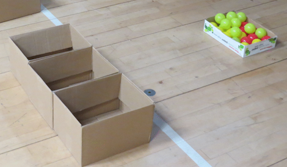
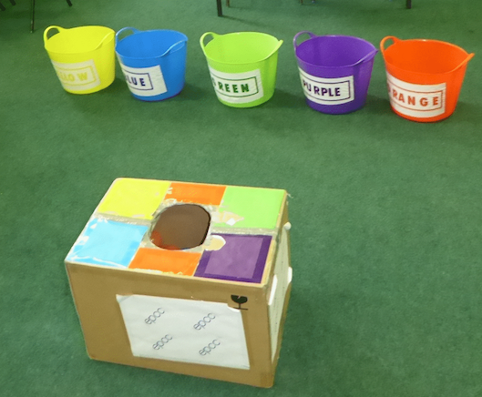
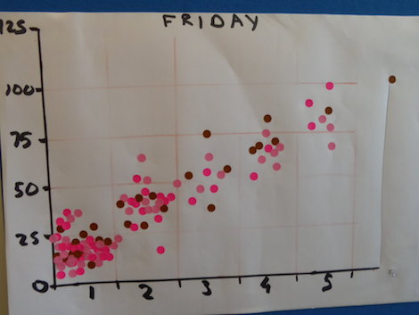

# Sorting

The aim of this activity is to demonstrate in a simple and effective manner:
* the basics of a sorting algorithm and why it is relevant to computing and supercomputing
* the benefits of performing tasks in parallel and why this is applicable to supercomputing

## Learning objectives

On completing this activity, participants should have:
* A basic understanding of one or two methods of sorting and how sorting is used in modern computing and supercomputing
* An understanding of how supercomputers work in parallel to solve problems
   * How multiple people sorting will do more than one person in the same
  time or the same end can be achieved in less time.
   * How modern parallel computers operate on the same principle.
   * How bottlenecks and challenges exist that can slow things down.
   
## Pre-requisites

This activity assumes that you have already discussed the basics of a computer and what it is used for. It also assumes that you have given a short explanation of a supercomputer, explaining that this is made up of many many computers connected together. See activities XX and YY for further information on these topics.

## Overview

## Equipment

The equipment required for this activity is relatively simple
and can go as far as your budget will stretch. The minimum
set-up would be:

* A set of coloured objects to sort, e.g. balls, bean bags, etc.
* A box or bag to contain the coloured objects. This is the sorting source.
* As many smaller boxes as there are colours - these are the sorting sinks.
* A timer (digital or analogue) that can count down 30s or 1min.
* A sheet of A3 with a pen sticky dots to note the number of objects sorted
  int the allotted time.

Label each of the coloured object sinks, e.g. boxes, with the colour that
it is supposed to act as a sink for - you can either print a label
(good to use coloured labels so that green is in green ink,etc for those
that are too young to read, e.g. here is a [pdf&nbsp;file](pdf/SortingLabels.pdf) 
you could use) for each box or you could get coloured boxes/trugs that match the
colour of the objects that you are trying to sort - you could also lable those.

You can be as sophisticated as you like. We started off with a simple
set of boxes:

moved on to use trugs and a boxes:

and now use trugs placed on a flower stand and have changed the
balls for small pyramid bean bags. 

The one thing that you do need to be careful with is that the action
at the source container can get a little bit frenetic so make
sure that there are no sharp edges or hard bits that could cause
damage to young hands.

## Scenario

To run this activity place the coloured object source and place the
ball sinks nearby. You can optionally prepare an A3 sheet with the
numbered of colour objects you have along the y-axis and the number
of people involved in the activity on the x-axis (see the diagram
below), you can then get your participants to register their scores
as they complete the activity.

Explain to your audience that you are going to demonstrate the
benefits of doing things in parallelis. Tell them that they can
only use one hand for this task and only process one object at a
time so if you are using coloured balls you can only have one coloured
ball in your hand at a time - this helps to level the playing field as
some people, if their hands are large, will be able to handle more
than one object at a time.

You then:

* Get one person to sort as many coloured objects as they can in 30s. 
* Count the objects they have sorted. Note down the score and/or get the participant
  to add a sticky dot or mark with a pen to the chart as shown below.
* Make sure the objects are well shuffled in the source container.
* Now get more than one person to carry out the same task. You can repeat with as 
  many people as you have in the group.

Try to get as many people involved in the process, so while one person is sorting
another can be the time keeper.

## Discussion

You will note that, as the number of people increases, the number
of objects sorted does not increase linearly. Ask them why this is?
Usually there is contention getting to the coloured objects or
getting access to the source container. You can draw anologies with
what happens in machines - memory contention, etc. You can also
introduce the idea of [speedup](https://en.wikipedia.org/wiki/Speedup)
but bear in mind that in most cases you will not be dealing with a
homogenous system, e.g. a 5-year old child setting the baseline and
then performing the same task with their parent.

<!-- Licensing and copyright stuff below -->
 

 
This work is licensed under a <a rel="license" href="http://creativecommons.org/licenses/by-nc-sa/4.0/">
Creative Commons Attribution-NonCommercial-ShareAlike 4.0 International License</a>. 
&copy; Copyright EPCC, The University of Edinburgh 2017.
