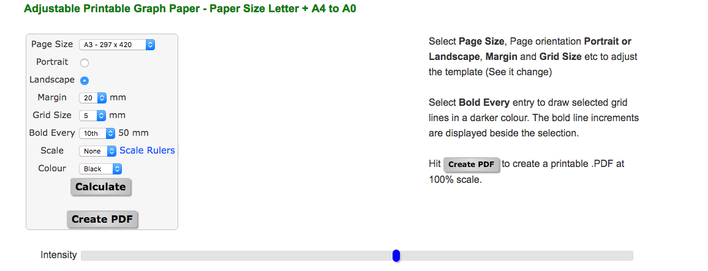

# Sorting

The aim of this activity is to demonstrate in a simple and effective manner:
* the basics of a sorting algorithm and why it is relevant to computing and supercomputing.
* the benefits of performing tasks in parallel and why this is applicable to supercomputing.

## Learning objectives

On completing this activity, participants should have:
* A basic understanding of one or two methods of sorting and how sorting is used in modern computing 
  and supercomputing.
* An understanding of how supercomputers work in parallel to solve problems.
   * How multiple people sorting will do more than one person in the same
     time or the same end can be achieved in less time.
   * How modern parallel computers operate on the same principle.
   * How bottlenecks and challenges exist that can slow things down.
   
## Pre-requisites

This activity assumes that you have already discussed the basics
of a computer and what it is used for. It also assumes that you
have given a short explanation of a supercomputer, explaining that
this is made up of many many computers connected together.

## Overview

The purpose of this activity is to sort a set of coloured balls
into their different colours, either measuring the time it takes
to sort a fixed number of balls or measuring the number of balls
that can be sorted in a fixed amount of time.

Once one person has carried out the sort, the sort is repeated with
two people, then with more people again. Each time the time and/or
number of balls is recorded.

At the end of the activity you should be able to see that by adding
more people you have been able to sort the same number of balls
more quickly, or have been able to sort more balls within the same
fixed period of time.

## Equipment

The equipment required for this activity is relatively simple
and can go as far as your budget will stretch. The minimum
set-up would be:

* A set of coloured objects to sort, e.g. balls, bean bags, etc.
* A box or bag to contain the coloured objects. This is the sorting source.
* As many smaller boxes as there are colours - these are the sorting sinks.
* A timer (digital or analogue) that can count down 30s or 1min.
* A sheet of A3 with a pen sticky dots to note the number of objects sorted
  in the allotted time.

Label each of the coloured object sinks, i.e. boxes, with the colour
that it is supposed to act as a sink for - you can either print a
label or get coloured boxes/bucket that match the colour of the
objects that you are trying to sort - you could also label these.

Note it is helpful to use labels that are both coloured and have
the written name of the colour. This allows for both young children
who cannot yet read and also for participants who have colour
blindness.

Labels are available to download at: [pdf&nbsp;file](pdf/SortingLabels.pdf) 

You can be as sophisticated or as simple as you like. Three examples
are given below, ranging in price and sophistication.

Simple boxes can be used, similar to those found in a stationery
cupboard at work:

Or a slightly more advanced set of buckets and decorated boxes:

To a set of buckets and a colourful stand (originally a flower
stand) with a set of small pyramid bean bags.

Graph paper for use with the ball sort can be generated via:
https://www.blocklayer.com/graph-paper.aspx some sample blank paper
with ~5mm spacing which should be useable with the the small sticky
circles can be generated using the options given by the image below. 

An A3 graph for use with 100 balls and up to 7 people participating
can be found [here](pdf/ballsort-graph-paper.pdf). It should be
possible to tweak the text sizes, numbers etc easily enough using
any pdf editor. Apple Preview was used to annotate the pdf linked
here.

## Scenario

To run this activity place the coloured object source and place the
ball sinks nearby. 

You can optionally prepare an A3 sheet with the
numbered of colour objects you have along the y-axis and the number
of people involved in the activity on the x-axis (see the diagram
below), you can then get your participants to register their scores
as they complete the activity.

Explain to your audience that you are going to demonstrate the
benefits of doing things in parallel. Tell them that they can
only use one hand for this task and only process one object at a
time so if you are using coloured balls you can only have one coloured
ball in your hand at a time. This helps to level the playing field as
some people, if their hands are large, will be able to handle more
than one object at a time.

You then:

* Get one person to sort as many coloured objects as they can in e.g. 30s. 
* Count the objects they have sorted. Note down the score and/or get the participant
  to add a sticky dot or mark with a pen to the chart as shown below.
* Make sure the objects are well shuffled in the source container.
* Now get more than one person to carry out the same task. You can repeat with as 
  many people as you have in the group.

## Discussion - parallelism

Discuss your results with the participants. It is likely that the number of balls that have 
been sorted increases with the number of people sorting. This is very similar to the simplest 
cases of running a code on a supercomputer - the more processors you add the more work you 
can do in the same time.

You will also likely note that, as the number of people increases, the number
of objects sorted does not increase linearly. Ask them why this is.
Usually there is contention getting to the coloured objects or
getting access to the source container. You can draw anologies with
what happens in computers - memory contention, etc. You can also
introduce the idea of [speedup](https://en.wikipedia.org/wiki/Speedup).

Bear in mind that in most cases you will not be dealing with a
homogenous system, e.g. a 5-year old child setting the baseline and
then performing the same task with their parent. Hence don't be surprised if the results don't 
show perfect speedup, this is all worth discussion and has analogies with computers and supercomputers.

## Discussion - sorting

So far you have used sorting to demonstrate how parallelism works, but have not discussed the nature of 
sorting and its relevance to supercomputers and every day life. When running this activity is is worthwile 
discussing this.

Good discussion point are:

* Sorting algorithms are used everyday and are all around you. For example, when you shop on-line you 
can often sort the items by price and relevance.
* Supercomputers have been used to sort and compare the interactions between genes in the human body. This 
helps identify gene interactions that may increase the risk of a person developing a particular disease. 
This can help to provide early treatment and intervention.
* There are many different types of sorting methods. Some can be run in parallel with different parts of the 
sort being carried out on different cores. 

If you wish to discuss sorting in more detail or try out different sorting methods, the post sort activity is
worth considering.

## Other considerations

Depending on the enthusiasm of your participants, the action at the source container can get a little bit frenetic so make
sure that there are no sharp edges or hard bits that could cause damage to young hands. 

Try to get as many people involved in the process, so while one person is sorting another can be the time keeper.

The example above sorts as many balls as you can in a fixed period of time. This is beneficial at 
e.g. a science festival when you want to place a limit on the time each person interacts with an activity,
to give others an opportunity to participate. However you can also sort a fixed number of balls and measure 
the time this takes with different numbers of people.

## Resources

* Labels for the boxes and trugs are available to download at: [pdf&nbsp;file](pdf/SortingLabels.pdf).
* "How do you use a Supercomputer" flyer. This is a good piece of supporting material for this 
activity, providing a simple overview of sorting and parallel sorting. See: https://www.epcc.ed.ac.uk/sites/default/files/PDF/How_do_you_use_a_supercomputer.pdf

##
<!-- Licensing and copyright stuff below -->
 

 
This work is licensed under a <a rel="license" href="http://creativecommons.org/licenses/by-nc-sa/4.0/">
Creative Commons Attribution-NonCommercial-ShareAlike 4.0 International License</a>. 
&copy; Copyright EPCC, The University of Edinburgh 2017.
