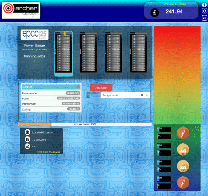

<!-- Begin Header -->
<table width="100%" border="0" cellpadding="0" cellspacing="0">
<tr>
<td markdown="span">

</td>
<td markdown="span">

</td>
<td markdown="span">

</td>
</tr>
</table>
<!-- End Header -->

# Supercomputing Challenge

## Background

EPCC has created a web
application,
[archer&nbsp;challenge](https://archer-webapps.epcc.ed.ac.uk/challenge),
that allows user to simulate the running of a computer centre.  A user
starts with an initial budget that they can use to purchase a computer
system for their centre.  Income is then generated by running
jobs. This cash allows the player to buy new nodes and or upgrade the
hardware and thus is able to run more and bigger jobs which in turn
generates more income. Some budget must also be maintained to allow
for unforseen events to be addressed such as repairing node failures
which require cash to repair.

## Objectives

* Keep your job as long as possible.
* Be a national HPC centre
* Upgrade and/or buy more hardware to run more jobs or jobs that have
  larger requirements.
* Process more FLOPS
* The full game balances money with the machine more fully. In terms of you have power bills & if you go into debt the lights go out and you loose. You can borrow money & the interest rate changes too. Also the full game explores aspects such as cooling (lower running cost) and interconnect (increases PE.) The bank is also an aspect of this, where you can see transactions and their impact on your balance.
* The festival version is much sharper and shorter, just focusing in on the money you make from jobs and you only "loose" when the time runs out. I.e. it is how many FLOPs you can get in 90 seconds and that's it. Money here drives the machine you can buy which = more FLOPS. Whereas in full game this also ends the game so adds an extra dimension.

## Learning objectives

* Become aware that better hardware allows you to tackle existing jobs
  faster or bigger jobs.
* It costs money to run these machines and that is an important aspect to balance
* We use these for a variety of scientific jobs
* Not just the power of the hardware (although that is important) but also aspects such as cooling & interconnect.

## Equipment

* A networked connection is required to enable the supercomputing
  application to be run. A desktop/laptop with a web browser.

## Method

The game initially requires a little bit of explanation but once
the basics have been gone over the game is relatively self evident. More
nodes allows the throughput of jobs to increase, more powerful hardware
allows bigger jobs to be run that generate more income. A leaderboard
allows individuals to add their name to the top scores. The walk-through on the festival mode is much better, but full interactive help is provided and an advisor is present to assist.

## Discussion points

* What is the best strategy?
* What jobs interest you the most?
* What sort of hardware is most suited?

## Want to know more?

If you want to know more about EPCC Outreach activities visit:

* https://www.epcc.ed.ac.uk/discover-and-learn

<!-- Licensing and copyright stuff below -->
 

 
This work is licensed under a <a rel="license" href="http://creativecommons.org/licenses/by-nc-sa/4.0/">
Creative Commons Attribution-NonCommercial-ShareAlike 4.0 International License</a>. 
&copy; Copyright EPCC, The University of Edinburgh 2017.

